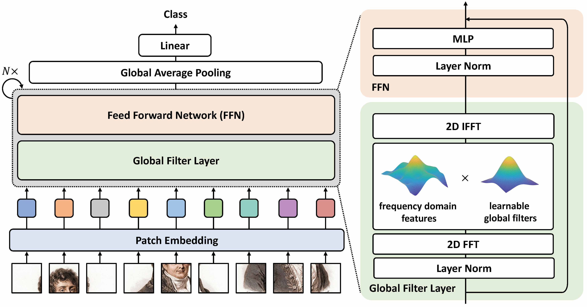

# Alzheimer's Disease Classification using GFNet on the ADNI Dataset

##  Overview
Alzheimer's is a disease that affects memory, thinking and behavior. Symptoms eventually grow severe enough to interfere with daily tasks [1](). Early detection and treatment play a important role in treating this disease. This model tries to classify the brain MRI scans from the Alzheimer’s Disease Neuroimaging Initiative (ADNI) dataset into two categories:
- AD (Alzheimer’s Disease)
- NC (Normal Cognition)

The goal is to automatically detect early signs of Alzheimer’s Disease from structural MRI images, thereby supporting clinical diagnosis and research.  The implemented model is based on a *Global Filter Network (GFNet)*   architecture using PyTorch, trained and validated on pre-processed MRI slices from the ADNI dataset.


## Model Architechture
A Global Filter Network (GFNet) architechture is used in this project is developed by the Yongming Rao and others authors [2](). Rather than self-attention, GFNet does global frequency-domain filtering i.e., features are convoluted using a 2-D FFT(Fast Fourier Transform) followed by element-wise multiplication with learnable complex filters one channel/frequency, and inverted by an inverse FFT. These Global Filter (GF) blocks can be stacked up with the standard feed-forward layers provide a transformer-like backbone modeling global context with almost linear high level of complexities in image size, and hence a good fit in medical images.

  
*Figure 1: Overview of the Global Filter Network (GFNet) architecture [3]().*  


### How GFNet Works
- **Patch Embedding** : splits the image into non-overlapping patches and project to tokens.
- **Global Filter Layer** :  converts tokens to the Fourier domain, apply learnable complex filters, then invert back (captures global context efficiently).
- **Feed-Forward Network (FFN)** : per-token MLP + residuals.
- **Head** : global average pooling to linear classifier.

Each Global Filter (GF) block within the network consists of a segment of major layers that coexist in order to capture global and local information. A patch embedding layer is the first stage in which the input image is subjected to separate the MRI into non-overlapping 16x16 patches, and projection into high-dimensional feature linear tokens. These tokens are then fed through several stacked GF blocks with layer in them. Normalization layer of stable feature scaling, a Global Filter Layer that executes the frequency-domain filtering with FFT/IFFT and a Feed-Forward Network (FFN) which optimizes the filtered features with two non-linear activation fully connected layers. Remnant attachments of the filtering and FFN submodules maintain the flow of features and eliminate the gradient. Once all GF blocks have been used, the network applies global average pooling to combine the learned representations to the spatial locations, and then a fully linked linear layer and a softmax activation to generate the final probabilities of the classes of Alzheimer Disease (AD) and Normal Cognition (NC) [3]().


## Problem Definition
Given a 2D MRI image of the human brain, the model predicts whether the scan belongs to an Alzheimer’s patient or a cognitively normal patient.  
The pipeline consists of following stages:

**1**. **Data Loading & Pre-processing**
   - For preprocessing of the data, when we run the train.py script, we call the dataset.py script.
   - The training data is divided into train (80 percent), validation (20 percent) and the test set is utilized in the specific case of testing the final performance only.
   - The images are rescaled to 256x256, normalized by using a hardcoded mean (0.1155) and standard deviation (0.2244) of the training images with the help of the utils.py script.
   - Images were converted to greyscale so that images would have similarities and because it would take less time to compute.
  - Data augmentation (random augmentation, random cropping and horizontal flips) is also used exclusively on the training set to enhance generalization.

**2**. **Model Architecture**
   - The script modules.py outlines the architecture of the Global Filter Network (GFNet) to classify the Alzheimer Disease.
   - It has the patch embedding layer, which transforms MRI images into tokens, a series of Global Filter Blocks, which do frequency-domain filtering and feature refinements, and the last classification head.
   - Supporting elements like LayerNorm, DropPath and two-layer MLP with GELU activation and dropout are also implemented in the script. Through these, all these modules allow the model to effectively represent the global spatial relationship in MRI scans.


**3**. **Training & Evaluation**
   - The model is trained using Cross-Entropy Loss and optimized with AdamW optimizer using train.py script.
   - The trained model is evaluated on a held-out test set, and predictions are visualized with class predictions and confusion matrix using predict.py script.

## Requirements

This project was implemented and evaluated on Google Colab Pro using the following key packages:  

- Python: 3.x
- matplotlib: 3.8.2
- numpy: 2.1.4 
- scikit_learn: 1.4.2
- timm: 1.0.11
- torch: 2.2.2+cu121
- torchvision: 0.17.2

NVIDIA (A100 GPU) and CUDA (12.x) were provided by Colab Colab Pro at run time.

## Dataset 
ADNI MRI dataset is mounted from Google Drive in Colab. Directory structure of the dataset is as follows:
```
AD_NC/
 ├── train/
 │    ├── AD/
 │    └── NC/
 └── test/
      ├── AD/
      └── NC/
```
### Hyperparameters used in the model:

        img_size=256,
        patch_size= 16,
        embed_dim=512,
        num_classes=2,
        in_channels=1,
        drop_rate=0.5,
        depth=19,
        mlp_ratio=4.,
        drop_path_rate=0.25,
        norm_layer=partial(nn.LayerNorm, eps=1e-6)

## Usage Examples

This project includes a path reference for the UQ Rangpur HPC cluster inside the dataset.py file which was was added only to ensure that the code can automatically locate the dataset if executed on Rangpur. However, this project was trained and tested entirely on Google Colab Pro, and no experiments were run on the Rangpur cluster. The code defaults to the Google Drive dataset path: /content/drive/MyDrive/ADNI/AD_NC


### Training
Run the train.py script on the google colab:
- It will save the model checkpoint at */content/drive/MyDrive/checkpoints_gfnet/gfnet_last.pth*.
- The training and validation loss plot and validation accuracy plot are saved to */content/drive/MyDrive/gfnet_outputs*.

### Testing 
Run the predict.py script on the google colab:
- Generates class predictions and saves result images.
- Generates confusion matrix.

Both the above results are saved in */content/drive/MyDrive/gfnet_outputs*.


## Results

**Training and Validation Curves**

The GFNet model was trained for 60 epochs on the ADNI dataset using the AdamW optimizer and cross-entropy loss for 1.58 hours on Google Colab Pro A100 GPU.
The training and validation loss curves show a smooth and consistent downward trend, indicating that the model effectively minimized classification error over time without signs of instability or divergence. The validation loss decreases steadily and remains lower than the training loss toward the end of training, suggesting strong generalization and the absence of overfitting.


*Figure 2: Training and validation loss and accuracy curves.*  

**Validation Accuracy Plot**

In the validation accuracy plot, accuracy rises rapidly during the initial epochs (reaching ~80% by epoch 18) and gradually plateaus around 92%, indicating convergence to an optimal representation of the data. This trend demonstrates that the GFNet architecture captured both local and global structural features from the MRI scans.


*Figure 3: Validation accuracy rising steadily and reaching 80% by epoch 18 and reaching around 92% at convergence.*  

**Confusion Matrix**

When evaluated on the held-out ADNI test set, the trained GFNet model achieved a **test accuracy of 66.8% with a test loss of 1.068**. The confusion matrix indicates that the model correctly classified 2451 AD and 3572 NC samples, while misclassifying 2009 AD images as NC and 984 NC images as AD. The results reveal a noticeable performance gap between validation (92%) and test accuracy (~67%), suggesting a probability of overfitting to the training distribution.

Various measures were used to increase the accuracy of the models, such as data augmentation (flips, rotations and normalization), hyperparameter optimization (different learning rates, optimizers and batch sizes). The use of regularization methods like dropout and weight decay, increasing number of epochs, early stopping were also used to stabilize the training process and alleviate overfitting. The model, however, stopped at 66.8 percent validation accuracy.


*Figure 4: Confusion matrix illustrating the distribution of correct and incorrect predictions on the ADNI test set.*  

**Test Predictions**

The model was also evaluated qualitatively on four randomly selected test samples. The true and predicted labels were:


*Figure 5: Randomly selected test samples with their true and predicted labels (AD vs NC), showing correct and misclassified cases.*


## Conclusion
The findings show that the Global Filter Network (GFNet) performed fairly well in accurately classifying Alzheimer Disease and Normal Cognition on the basis of MRI scan, with high training and validation scores. However, generalization to unseen test data could be improved. An additional increase in model depth or the embedding dimension may have the benefit of improving the ability of the network to capture more complicated spatial relationships within brain structures, but would require longer training and higher computational costs. Future works would also seek to explore variants of GFNet or hybrid architectures (e.g. CNNstyle hierarchical models or transformer filter hybrids), which may be more successful at learning local and global dependencies in MRI data. The utilization of larger and more heterogeneous datasets, balanced sampling, enhanced regularization or domain adaptation could also enhance better tests and model robustness to various images.


## References
[1] Alzheimer’s Association, “What is Alzheimer’s Disease?,” Alzheimer’s Association, 2025. [Online]. Available: https://www.alz.org/alzheimers-dementia/what-is-alzheimers
. [Accessed: 30-Oct-2025].

[2] Y. Rao, W. Zhao, Z. Zhu, J. Zhou, and J. Lu, “GFNet: Global Filter Networks for Visual Recognition,”
IEEE Transactions on Pattern Analysis and Machine Intelligence, vol. 45, no. 9, pp. 10 960–10 973, Sep. 2023,
conference Name: IEEE Transactions on Pattern Analysis and Machine Intelligence. [Online]. Available:
https://ieeexplore.ieee.org/document/10091201?denied=

[3] R. Gong, J. Liu, S. Jiang, T. Zhang, H. Li, and J. Yan, “Global Filter Networks for Image Classification,” arXiv preprint arXiv:2107.00645, 2021. [Online]. Available: https://github.com/raoyongming/GFNet

#### AI Acknowledgement

ChatGPT (OpenAI, GPT-5, 2025) was used for language editing, report structuring, and generating Markdown (.md) syntax. All coding, analysis, and interpretation were independently performed by the author.

### Submitted By
---
**Name:**  *Lasya Sahadeva Reddy*

**Student ID**: *47336991*
