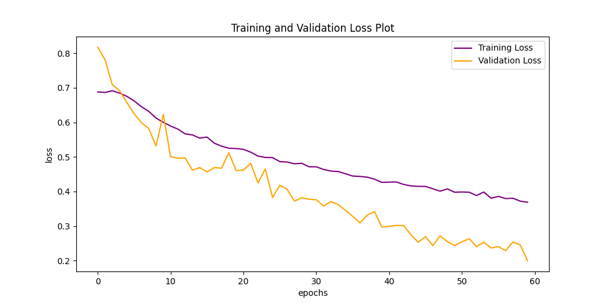
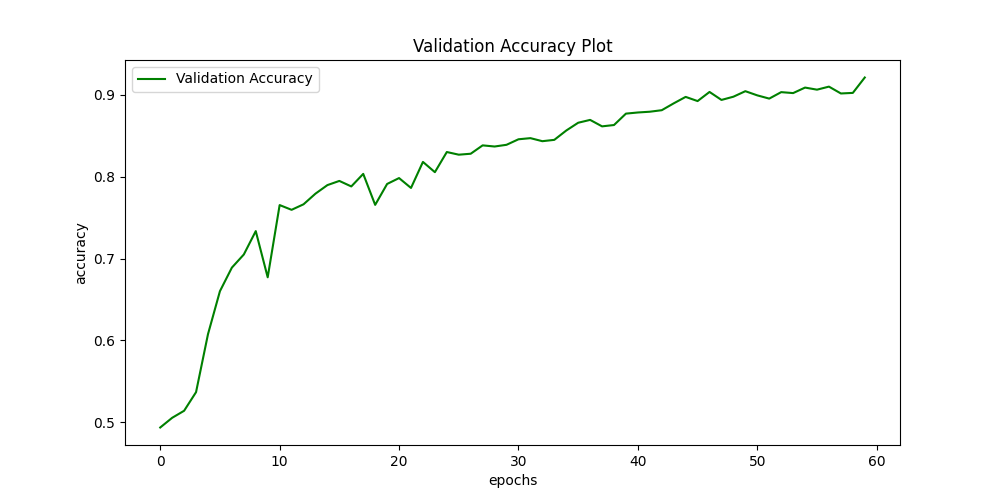
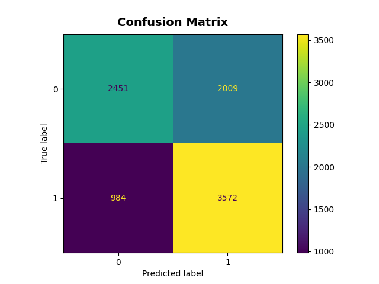
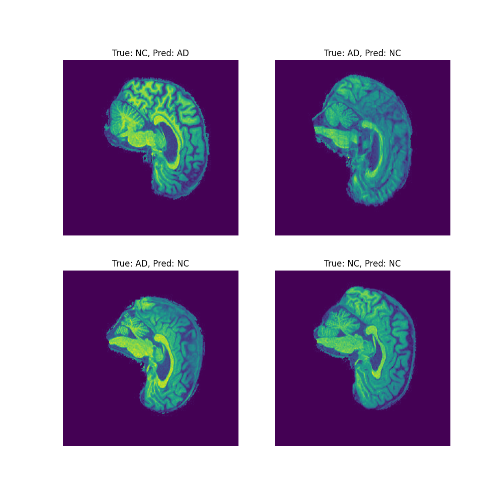

# Alzheimer's Disease Classification using GFNet on the ADNI Dataset

##  Overview
Alzheimer's is a disease that affects memory, thinking and behavior. Symptoms eventually grow severe enough to interfere with daily tasks [1](). Early detection and treatment play a important role in treating this disease. This model tries to classify the brain MRI scans from the Alzheimer’s Disease Neuroimaging Initiative (ADNI) dataset into two categories:
- AD (Alzheimer’s Disease)
- NC (Normal Cognition)

The goal is to automatically detect early signs of Alzheimer’s Disease from structural MRI images, thereby supporting clinical diagnosis and research.  The implemented model is based on a *Global Filter Network (GFNet)*   architecture using PyTorch, trained and validated on pre-processed MRI slices from the ADNI dataset.


## Model Architechture
This project uses  a Global Filter Network (GFNet) architechture designed by the Yongming Rao and other authors [2](). Instead of self-attention, GFNet performs global frequency-domain filtering i.e., features are transformed with a 2-D FFT(Fast Fourier Transform), multiplied element-wise by learnable complex filters one per channel/frequency, and transformed back with an inverse FFT. Stacking these Global Filter (GF) blocks with standard feed-forward layers gives a transformer-style backbone that models global context with near linear complexity in image size, making it a strong fit for medical images.

  
*Figure 1: Overview of the Global Filter Network (GFNet) architecture [3]().*  


### How GFNet Works
- **Patch Embedding** : splits the image into non-overlapping patches and project to tokens.
- **Global Filter Layer** :  converts tokens to the Fourier domain, apply learnable complex filters, then invert back (captures global context efficiently).
- **Feed-Forward Network (FFN)** : per-token MLP + residuals.
- **Head** : global average pooling to linear classifier.

Each Global Filter (GF) block in the network is composed of several key layers that work together to capture both global and local information. The input image first passes through a patch embedding layer, which divides the MRI into non-overlapping 16×16 patches and linearly projects them into high-dimensional feature tokens. These tokens are then processed by multiple stacked GF blocks, each containing a Layer Normalization layer for stable feature scaling, a Global Filter Layer that performs the frequency-domain filtering operation using FFT/IFFT, and a Feed-Forward Network (FFN) that refines the filtered features through a pair of fully connected layers with non-linear activations. Residual connections around both the filtering and FFN submodules preserve feature flow and prevent gradient vanishing. After all GF blocks, the network applies global average pooling to aggregate the learned representations across spatial locations, followed by a fully connected linear layer and softmax activation to produce the final class probabilities for Alzheimer’s Disease (AD) and Normal Cognition (NC) [3]().


### Problem Definition
Given a 2D MRI image of the human brain, the model predicts whether the scan belongs to an Alzheimer’s patient or a cognitively normal patient.  

### How It Works
The pipeline consists of three major stages:

**1**. **Data Loading & Pre-processing**
   - The data preprocessing is done when we run the train.py script by calling the dataset.py script.
   - The training data is split into train (80%), validation (20%), and the test set is used only for final performance testing.
   - Images are resized to 256×256 and normalized using the hardcoded mean (0.1155) and standard deviation (0.2244) computed from the training set using the utils.py script.
   - Images were set to greyscale to ensure images were consistent and to reduce computation time.
   - Data augmentation (random augmentation, random cropping and horizontal flips) is applied only to the training set to improve generalization.

**2**. **Model Architecture**
   - The modules.py script defines the Global Filter Network (GFNet) architecture used for Alzheimer’s Disease classification. 
   - It includes the patch embedding layer that converts MRI images into tokens, multiple Global Filter Blocks that perform frequency-domain filtering and feature refinement, and the final classification head. 
   - The script also implements supporting components such as LayerNorm, DropPath, and a two-layer MLP with GELU activation and dropout. Together, these modules enable the model to efficiently capture global spatial relationships in MRI scans.


**3**. **Training & Evaluation**
   - The model is trained using Cross-Entropy Loss and optimized with AdamW optimizer using train.py script.
   - The trained model is evaluated on a held-out test set, and predictions are visualized with class predictions and confusion matrix using predict.py script.

## Requirements

This project was implemented and evaluated on Google Colab Pro using the following key packages:  

- Python: 3.x
- matplotlib: 3.8.2
- numpy: 2.1.4 
- scikit_learn==1.4.2
- timm: 1.0.11
- torch: 2.2.2+cu121
- torchvision: 0.17.2

GPU type (T4/A100) and CUDA (12.x) were provided by Colab at run time.

## Dataset 
ADNI MRI dataset is mounted from Google Drive in Colab. Directory structure of the dataset is as follows:
```
AD_NC/
 ├── train/
 │    ├── AD/
 │    └── NC/
 └── test/
      ├── AD/
      └── NC/
```
### Hyperparameters used in the model:

        img_size=256,
        patch_size= 16,
        embed_dim=512,
        num_classes=2,
        in_channels=1,
        drop_rate=0.5,
        depth=19,
        mlp_ratio=4.,
        drop_path_rate=0.25,
        norm_layer=partial(nn.LayerNorm, eps=1e-6)

## Usage Examples

This project includes a path reference for the UQ Rangpur HPC cluster inside the dataset.py file which was was added only to ensure that the code can automatically locate the dataset if executed on Rangpur. However, this project was trained and tested entirely on Google Colab Pro, and no experiments were run on the Rangpur cluster. The code defaults to the Google Drive dataset path: /content/drive/MyDrive/ADNI/AD_NC


### Training
Run the train.py script on the google colab:
- It will save the model checkpoint at */content/drive/MyDrive/checkpoints_gfnet/gfnet_last.pth*.
- The training and validation loss plot and validation accuracy plot are saved to */content/drive/MyDrive/gfnet_outputs*.

### Testing 
Run the predict.py script on the google colab:
- Generates class predictions and saves result images.
- Generates confusion matrix.

Both the above results are saved in */content/drive/MyDrive/gfnet_outputs*.


## Results

**Training and Validation Curves**

The GFNet model was trained for 60 epochs on the ADNI dataset using the AdamW optimizer and cross-entropy loss for 1.58 hours on Google Colab Pro A100 GPU.
The training and validation loss curves show a smooth and consistent downward trend, indicating that the model effectively minimized classification error over time without signs of instability or divergence. The validation loss decreases steadily and remains lower than the training loss toward the end of training, suggesting strong generalization and the absence of overfitting.



*Figure 2: Training and validation loss and accuracy curves.*  

**Validation Accuracy Plot**

In the validation accuracy plot, accuracy rises rapidly during the initial epochs (reaching ~80% by epoch 18) and gradually plateaus around 92%, indicating convergence to an optimal representation of the data. This trend demonstrates that the GFNet architecture captured both local and global structural features from the MRI scans.



*Figure 3: Validation accuracy rising steadily and reaching 80% by epoch 18 and reaching around 92% at convergence.*  

**Confusion Matrix**

When evaluated on the held-out ADNI test set, the trained GFNet model achieved a **test accuracy of 66.8% with a test loss of 1.068**. The confusion matrix indicates that the model correctly classified 2451 AD and 3572 NC samples, while misclassifying 2009 AD images as NC and 984 NC images as AD. The results reveal a noticeable performance gap between validation (92%) and test accuracy (~67%), suggesting a probability of overfitting to the training distribution.

Several strategies were implemented to improve model accuracy, including data augmentation (flips, rotations, and normalization), hyperparameter tuning (varying learning rates, optimizers, and batch sizes). Regularization techniques such as dropout and weight decay, along with early stopping, were also applied to stabilize training and reduce overfitting. Despite these efforts, the model’s validation accuracy plateaued at 66.8%.



*Figure 4: Confusion matrix illustrating the distribution of correct and incorrect predictions on the ADNI test set.*  

**Test Predictions**

The model was also evaluated qualitatively on four randomly selected test samples. The true and predicted labels were:



*Figure 5: Randomly selected test samples with their true and predicted labels (AD vs NC), showing correct and misclassified cases.*

Out of the four samples, the model correctly classified two images and misclassified two. The errors occurred where the MRI features of Alzheimer’s Disease (AD) and Normal Cognition (NC) appeared visually similar, indicating that the model can sometimes confuse subtle structural differences between diseased and healthy brains. Despite these isolated misclassifications, the predictions show that GFNet captures meaningful anatomical patterns and can generalize reasonably well to unseen scans.

## Conclusion
The results demonstrate that the Global Filter Network (GFNet) achieved a relatively high success rate in correctly classifying Alzheimer’s Disease and Normal Cognition from MRI scans, with strong training and validation performance. However, there remains room for improvement in generalization to unseen test data. Increasing the model depth or the embedding dimension could potentially enhance the network’s capacity to capture more complex spatial relationships in brain structures, though this would come at the cost of longer training time and higher computational requirements.
Future work could also explore GFNet variants or hybrid architectures, such as CNNstyle hierarchical models or transformer filter hybrids, which might better capture local and global dependencies in MRI data. Incorporating larger and more diverse datasets, balanced sampling, and advanced regularization or domain adaptation techniques may further improve test performance and model robustness across different imaging conditions.

## References
[1] Alzheimer’s Association, “What is Alzheimer’s Disease?,” Alzheimer’s Association, 2025. [Online]. Available: https://www.alz.org/alzheimers-dementia/what-is-alzheimers
. [Accessed: 30-Oct-2025].

[2] Y. Rao, W. Zhao, Z. Zhu, J. Zhou, and J. Lu, “GFNet: Global Filter Networks for Visual Recognition,”
IEEE Transactions on Pattern Analysis and Machine Intelligence, vol. 45, no. 9, pp. 10 960–10 973, Sep. 2023,
conference Name: IEEE Transactions on Pattern Analysis and Machine Intelligence. [Online]. Available:
https://ieeexplore.ieee.org/document/10091201?denied=

[3] R. Gong, J. Liu, S. Jiang, T. Zhang, H. Li, and J. Yan, “Global Filter Networks for Image Classification,” arXiv preprint arXiv:2107.00645, 2021. [Online]. Available: https://github.com/raoyongming/GFNet

#### AI Acknowledgement

ChatGPT (OpenAI, GPT-5, 2025) was used for language editing, report structuring, and generating Markdown (.md) syntax. All coding, analysis, and interpretation were independently performed by the author.

### Submitted By
---
**Name:**  *Lasya Sahadeva Reddy*

**Student ID**: *47336991*
